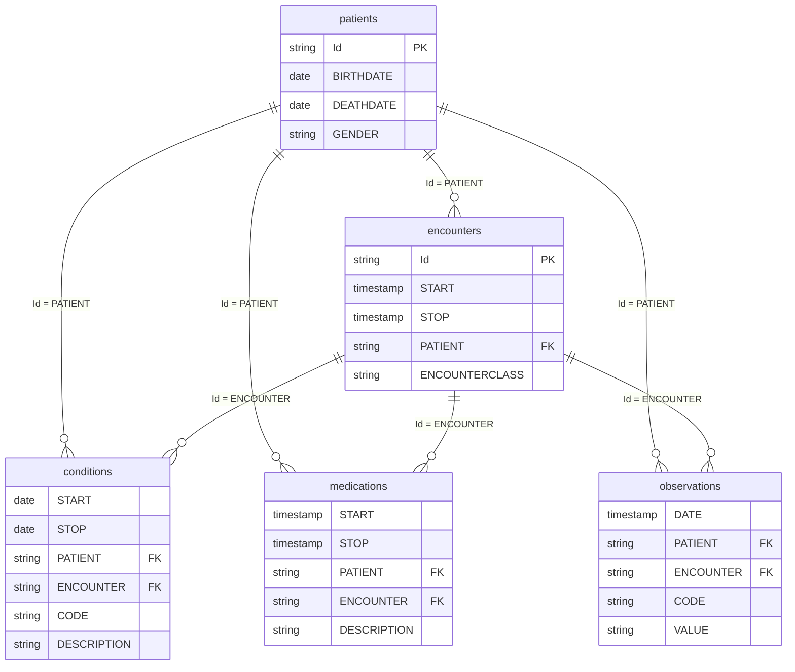

# Diagrama entidad-relación

Un paciente tiene muchas visitas. Cada visita puede tener varios diagnósticos, medicamentos y mediciones.

```mermaid
erDiagram
    patients ||--o{ encounters : "Id = PATIENT"
    patients ||--o{ conditions : "Id = PATIENT"
    patients ||--o{ medications : "Id = PATIENT"
    patients ||--o{ observations : "Id = PATIENT"
    encounters ||--o{ conditions : "Id = ENCOUNTER"
    encounters ||--o{ medications : "Id = ENCOUNTER"
    encounters ||--o{ observations : "Id = ENCOUNTER"

    patients {
        string Id PK
        date BIRTHDATE
        date DEATHDATE
        string GENDER
    }
    encounters {
        string Id PK
        timestamp START
        timestamp STOP
        string PATIENT FK
        string ENCOUNTERCLASS
    }
    conditions {
        date START
        date STOP
        string PATIENT FK
        string ENCOUNTER FK
        string CODE
        string DESCRIPTION
    }
    medications {
        timestamp START
        timestamp STOP
        string PATIENT FK
        string ENCOUNTER FK
        string DESCRIPTION
    }
    observations {
        timestamp DATE
        string PATIENT FK
        string ENCOUNTER FK
        string CODE
        string VALUE
    }
```
